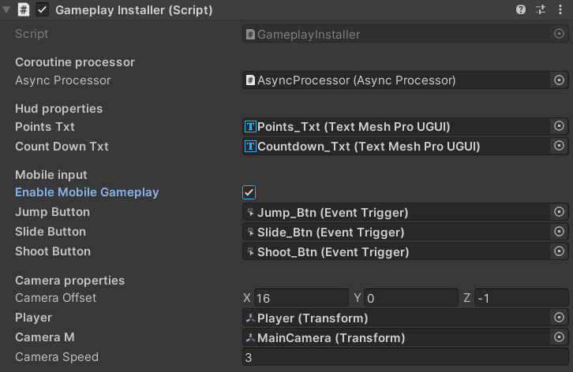
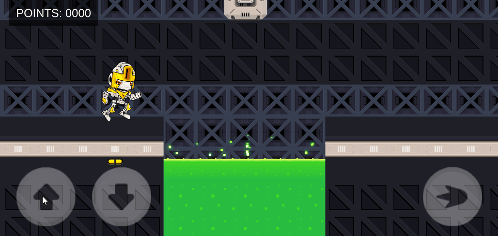
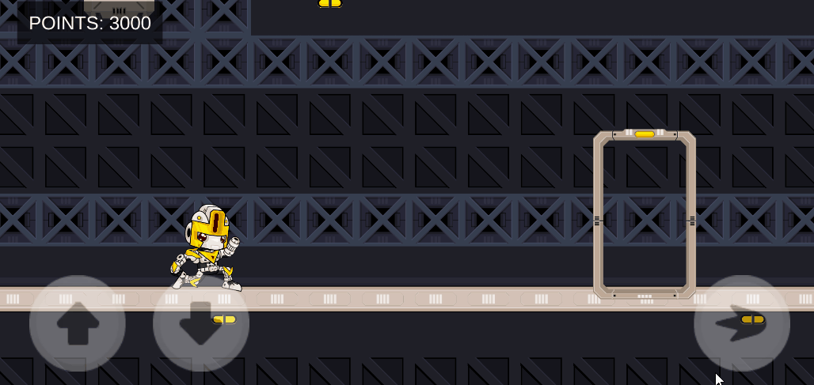
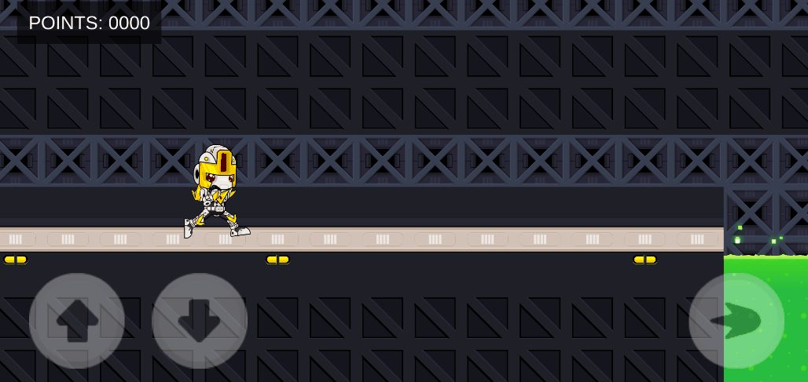

# 2D-plataform-runner-template 

# Overview
This Unity 2D project highlights a dynamic plataform runner game using Zenject. Your objective is to collect boxes for points while overcoming challenges like acid pools, massive saws, zombies, and locked puzzle doors. Utilize your weapon strategically to defend yourself and navigate through obstacles, reaching the end of stage.

## Important Notice

Please take note that the assets embedded in this project are exclusively intended for use within the context of this specific project. While you are not permitted to distribute these assets directly from this project, you are allowed to obtain them through the provided links for personal use or incorporation into other projects.

Thank you for your understanding and cooperation.

## 2D assets used
[Robot sprites](https://www.gameart2d.com/the-robot---free-sprites.html)

[Zombie sprites](https://www.gameart2d.com/the-zombies-free-sprites.html)

[Tileset](https://www.gameart2d.com/tileset.html)

## Programming assets

[Zenject](https://assetstore.unity.com/packages/tools/utilities/extenject-dependency-injection-ioc-157735)

[DOTween](https://assetstore.unity.com/packages/tools/animation/dotween-hotween-v2-27676)

## APK for test
[Download APK](https://github.com/muriloglasser/3D-ragdoll-implementation/blob/Readme-update/Punch%20Game.apk)

# How to Run the Project
Download Unity 2020.3.29f1.

Download the OpenJDK module and Android SDK & NDK tools for Android builds.

Download the iOS Build Support module for iOS builds.

Clone the repository to your local machine.

Open the project in Unity.

Change the build platform to Android or iOS.

# Features
### Change between desktop and mobile
Use this boolean on GameplayInstaller.cs to change code from mobile to desktop.

### Menu screen
Menu screen with start button.

### Jump
PC Controls: Press the "W" key to execute a jump.

Smartphone Controls: Utilize the on-screen button corresponding to jumping.

### Slide
PC Controls: Press the "S" key to initiate a sliding motion.

Smartphone Controls: Utilize the on-screen button designated for sliding.

### Shoot
PC Controls: Utilize the left mouse button to shoot.

Smartphone Controls: Utilize the on-screen shooting button.

### Collect points
Collect points during the match.

### Kill zombies
Kill zombies with your weapon.

### Doors
Unlock doors by activating a button.

### Death screen
Death screen with restart button and menu button.

# Thank You

I sincerely appreciate you taking the time to explore this project. I hope you enjoyed the experience and found valuable information. If you have any questions or suggestions, feel free to share them.